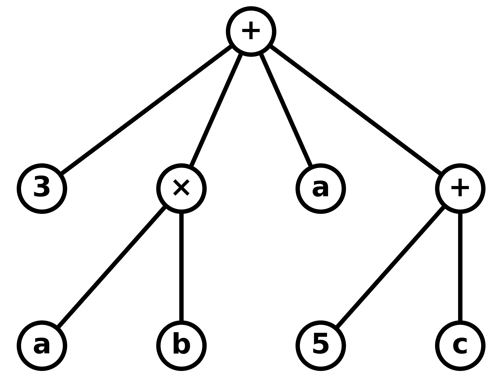

# Algebraic Expression Tree Generator & Solver
## About
An **expression tree** is a tree used to represent mathematical expressions. in which each internal node corresponds to an operator and each leaf node corresponds to an operand. For example, the expression `(3 + (a * b) + a + (5 + c))` can be represented by the expression tree 

Expression trees are not only a useful way to represent mathematical expressions, but also other kinds of structured code that a user wants to examine, modify, or execute.
